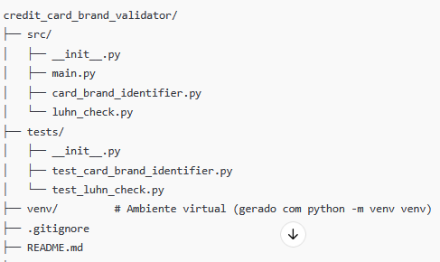
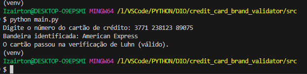
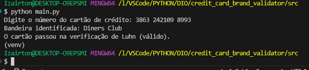
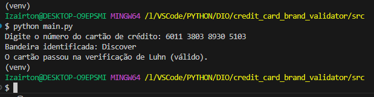
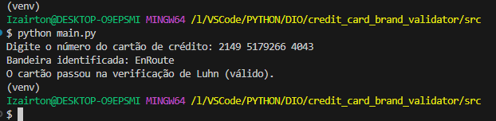
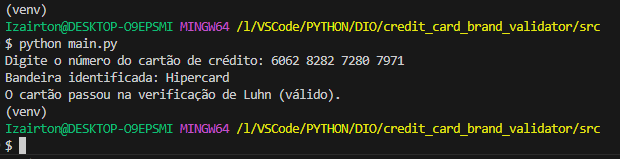
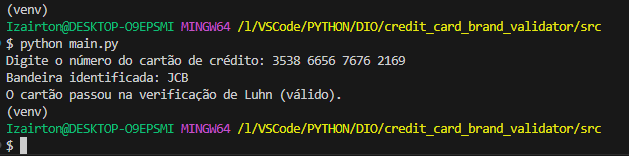
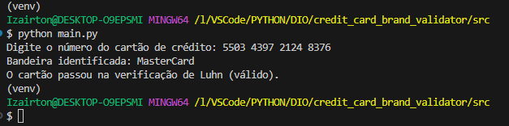
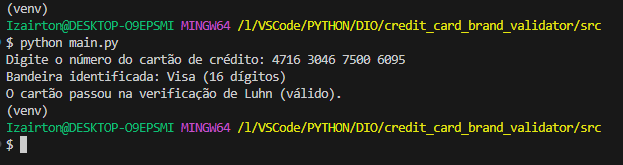
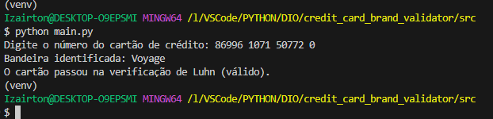

# 💳 Validador de Bandeiras de Cartão de Crédito com Python 🐍

## 🎯 Objetivo

Este projeto Python foi desenvolvido para identificar a bandeira de um cartão de crédito a partir do número informado, utilizando regras específicas e, opcionalmente, validando o número com o Algoritmo de Luhn.  

Ele serve como uma ferramenta para:

- **Validação e Identificação:** Determina a bandeira (Visa, MasterCard, American Express, Diners Club, Discover, JCB, Hipercard, Aura, EnRoute, Voyage) com base em prefixos e regras de formatação.
- **Exemplos de Aplicação:** Útil para testes, demonstrações e como base para sistemas de pagamento que necessitem dessa verificação.
- **Aprendizado:** Facilita o entendimento sobre processamento de strings, algoritmos de validação e regras de negócio para cartões de crédito.

## 🏗️ Estrutura do Projeto

O projeto está organizado em módulos para facilitar a manutenção e a leitura:

- **`src/main.py`:** Ponto de entrada do aplicativo.
- **`src/card_brand_identifier.py`:** Módulo responsável por identificar a bandeira do cartão com base em prefixos e regras.
- **`src/luhn_check.py`:** Módulo que implementa o Algoritmo de Luhn para validação do número do cartão.
- **`tests/`:** Contém testes unitários para as funções do projeto, garantindo a qualidade do código.
- **`requirements.txt`:** Lista as dependências necessárias (por exemplo, pytest).

## 🗂️ Fluxo de Execução

1. **Entrada do Número:** O usuário insere o número do cartão de crédito.
2. **Identificação da Bandeira:** O sistema analisa o número e determina a bandeira do cartão.
3. **Validação (Opcional):** O número é validado utilizando o Algoritmo de Luhn.
4. **Saída:** Exibe a bandeira identificada e informa se o cartão é válido ou não.

## 💻 Tecnologias Utilizadas

- **Python:** Linguagem de programação principal.
- **pytest:** Para execução de testes unitários.
- **Bibliotecas Padrão:** Utilizadas para manipulação de strings, cálculos matemáticos e lógica de validação.

## 🚀 Modo de Uso

1. **Pré-requisitos:**
   - Python 3.7 ou superior.
   - VSCode ou outro editor de sua preferência.
   - (Opcional) Ambiente virtual configurado.

2. **Criar um Ambiente Virtual (Recomendado):**

   python -m venv venv

    Ative o ambiente:

    Windows:
    .\venv\Scripts\activate

    Linux/macOS:
    source venv/bin/activate

3. **Instalar as Dependências:**

    Se houver dependências listadas no arquivo, execute:

    pip install -r requirements.txt

4. **Executar o Projeto:**

    python src/main.py

5. **Executar os Testes:**

    pytest

## 📁 Estrutura de Pastas

## 🚀 **Clonar o Repositório (ou Criar o Projeto):**

    git clone <https://github.com/IOVASCON/credit_card_brand_validator.git>

## 🖼️ Imagens do Desenvolvimento

**1. Validação Cartão American Express:**

**2. Validação Cartão Aura:**

**3. Validação Cartão Dibers Club:**

**4. Validação Cartão Discover:**

**5. Validação Cartão EnRoute:**

**6. Validação Cartão HyperCard:**

**6. Validação Cartão JCB:**

**6. Validação Cartão Master Card:**

**6. Validação Cartão Visa 16 Dígitos:**

**6. Validação Cartão Voyager:**

🤝 Contribuições

Contribuições são bem-vindas! Sinta-se à vontade para abrir issues e pull requests com melhorias e correções.

## 👤 Autor

[Izairton] - [IOVASCON](https://github.com/IOVASCON)

✨ Sugestões Futuras

- Adicionar suporte para novas bandeiras.
- Aprimorar a validação dos números de cartão.
- Implementar uma interface gráfica para facilitar o uso.
- Expandir os testes unitários e a cobertura de código.
